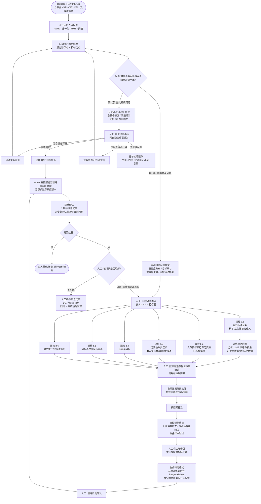

# 核心段流程重构：量化判定到训练评估

**文档类型：** 流程设计（重构版）  
**适用对象：** 软件 / 算法 / 项目负责人  
**版本：** v1.0  
**日期：** 2026-07-09  
**替换范围：** 原流程图"比对板端量化模型和ONNX浮点模型结果 → 模型迭代训练"段

---

## 1. 原段落的问题回顾

| 原节点 | 问题 | 严重程度 |
|---|---|:---:|
| 比对量化/浮点结果 | 比对内容/条件未定义，未对齐前后处理，缺平台维度 | 中 |
| 检测结果一致？ | 二分类逻辑错误：不一致≠量化问题；一致≠浮点问题（缺"是否复现"判断） | 高 |
| 人工排查量化问题 | 断头路，无回归主流程路径；人工介入太早，自动逐层分析缺位 | 高 |
| YOLOv8s 自动标注 | 用难例上不可靠的通用模型标难例；绕过全部标注策略；直接进训练=自动化制造背景污染 | 最高 |
| 通知进入训练 | 无人工确认门禁、无数据版本管理、无回归门禁 | 高 |

---

## 2. 重构后的完整流程



---

## 3. 关键设计说明

### 3.1 2a 量化判定段

| 设计点 | 说明 |
|---|---|
| 比对前对齐前后处理 | resize/归一化/NMS/阈值不对齐时，差异不是量化差异，结论必错 |
| 一致性量化标准 | 框 IoU 匹配率、置信度差、跨阈值框数量，不靠人眼 |
| 自动逐层分析先行 | 逐层 dump + 余弦相似度定位问题层，证据包备好再转人工 |
| 人工四条出路 | 混合量化→重新量化回验；QAT→回训练；前后处理→派软件修正回验；工具链→提单挂起（V861 内部 / V853 芯原） |

### 3.2 2b 问题分类段（b.1 ~ b.6）

| 分类 | 内容 | 特殊处理 |
|---|---|---|
| b.1 误检 | 背景标注污染（椅子/盆栽误检成人） | 必须先走训练数据溯源（11-12 数据集），定位污染源，再决定补数据或清洗 |
| b.2 误检 | 人与目标靠近但无交集 | 进标注策略，执行 IoU 规则 |
| b.3 误检 | 场景缺失（类人条状物/全图框/抖动） | 抖动类走视频数据挑选策略 |
| b.4 漏检 | 远距离目标 | 筛选时执行"复杂背景丢弃"规则 |
| b.5 漏检 | 目标重叠 | 筛选时执行"高重叠不标"规则 |
| b.6 漏检 | 姿态/卡阈值附近 | 可先评估阈值/后处理方案再决定是否动数据 |

自动初筛指标：置信度分布、目标尺寸分布、框间 IoU、逐帧框抖动幅度。初筛给建议标签，人工确认。

### 3.3 标注规则库（质检脚本自动执行）

| 规则 | 对应问题 | 自动化方式 |
|---|---|---|
| 人和椅子有 IoU → 都不标注 | b.1/b.2 | IoU 计算自动检查，违规标红 |
| 椅子与人无 IoU → 人和椅子分别标注 | b.1 | 自动检查漏标 |
| 静止画面抖动框 → 标注约 100 张上限 | b.3 | 自动计数，超量告警（防过拟合） |
| 画面抖动严重 → 专门挑选视频数据标注 | b.3 | 抖动幅度指标自动筛视频 |
| 远距离 + 复杂背景 → 丢弃，只留干净背景 | b.4 | 尺寸+背景复杂度初筛，人工终审 |
| 与其他目标重叠度高 → 不标注 | b.5 | IoU 自动过滤 |

原则：**策略定义由人拍板（STRAT 节点），策略执行与质检全部自动化。**
人工每新增一条规则即沉淀入规则库，系统自动化程度随使用递增。

### 3.4 标注执行五步流水线

```text
人工策略确认 → 自动筛选 → 模型预标注 → 自动规则质检 → 人工修正
```

- 预标注模型（如 YOLOv8s）仅作预标注，输出必须过质检和人审两道闸门
- 质检标红项为人工复核重点，未标红项抽检即可

### 3.5 数据合并与训练

| 设计点 | 说明 |
|---|---|
| 版本登记 | 合并 images+labels 时记录数据版本、合入来源 case、数量——支撑将来"哪批数据导致误检"的回溯 |
| 训练启动门禁 | 人工确认数据质量与训练目标后才触发 Amax 受限服务器训练 |
| 训练记录 | 自动记录参数、数据版本、环境，保证可复现 |

### 3.6 双重评估与"场景无解"出口

| 设计点 | 说明 |
|---|---|
| 双测试集 | 新标注测试集验证本次修复 + 专业测试集回归历史问题，防止修一个坏一个 |
| 不达标分流 | 人工判断该场景是否可解 |
| 可解 | 回到问题分类节点（HC）调整策略再迭代——不回到量化判定（已验证过） |
| 不可解 | 确认场景无解 → 记录已知限制 → 归档 → 客户预期管理。这是合法流程终点，不是失败 |
| 防死循环 | 建议同一 case 迭代超过 2~3 轮自动升级至负责人评审 |

---

## 4. 与原图的对照总结

| 维度 | 原图 | 重构版 |
|---|---|---|
| 量化判定 | 一个菱形 + 断头路人工框 | 前置对齐 + 自动逐层分析 + 人工四出路全部回主流程 |
| 问题分类 | "浮点模型误检或漏检"一句话 | b.1~b.6 六类显式节点，各有对应策略路径 |
| 数据溯源 | 无 | b.1 强制走 11-12 数据集溯源 |
| 标注 | YOLOv8s 自动标注直接进训练 | 策略确认→筛选→预标注→质检→人审五步 |
| 数据管理 | 无 | 版本登记 + 合入来源记录 |
| 训练 | 自动通知即训练 | 人工启动门禁 + 参数/数据版本记录 |
| 评估 | 无明确设计 | 双测试集 + 达标判断 |
| 出口 | 只能循环 | "场景无解"合法终点 + 迭代轮数上限 |
